# 🚀 Mordant Viewer Feature Demo

Welcome to a **single document** that exercises _almost every_ feature of the
Rust-powered `mordant` renderer. Drag this file into the viewer (or use the 📄
button) and toggle the **Sync mermaid** checkbox to recolor all diagrams with
your code-highlighting theme :sparkles:.

> 💡 Tip: change the *Highlighting* dropdown and watch both code blocks and
> Mermaid diagrams restyle together when **Sync mermaid** is enabled.

This paragraph demonstrates inline styles: **bold**, *italic*, ***both***,
`inline code`, ~~strikethrough~~, and a [link to the project](https://github.com).
Here is an inline formula: $E = mc^2$, and a second one with a square root:
$\sqrt{x^2 + y^2}$.

---

## 1. Code highlighting (5 languages)

### Python :snake:

```python
from dataclasses import dataclass


@dataclass
class Point:
    x: float
    y: float

    def distance(self, other: "Point") -> float:
        return ((self.x - other.x) ** 2 + (self.y - other.y) ** 2) ** 0.5


if __name__ == "__main__":
    p = Point(0.0, 0.0)
    q = Point(3.0, 4.0)
    print(f"distance = {p.distance(q)}")  # 5.0
```

### Rust :crab:

```rust
use std::collections::HashMap;

fn word_count(text: &str) -> HashMap<&str, usize> {
    let mut counts = HashMap::new();
    for word in text.split_whitespace() {
        *counts.entry(word).or_insert(0) += 1;
    }
    counts
}

fn main() {
    let map = word_count("the quick brown fox the lazy dog");
    println!("the -> {}", map["the"]);
}
```

### TypeScript :computer:

```typescript
interface User {
  id: number;
  name: string;
  roles: string[];
}

async function fetchUser(id: number): Promise<User> {
  const res = await fetch(`/api/users/${id}`);
  if (!res.ok) throw new Error(`HTTP ${res.status}`);
  return (await res.json()) as User;
}

fetchUser(1).then((u) => console.log(u.name));
```

### Go :globe_with_meridians:

```go
package main

import (
	"fmt"
	"sort"
)

func main() {
	nums := []int{5, 2, 9, 1, 5, 6}
	sort.Ints(nums)
	fmt.Println("sorted:", nums)

	total := 0
	for _, n := range nums {
		total += n
	}
	fmt.Println("sum:", total)
}
```

### C++ :gear:

```cpp
#include <iostream>
#include <vector>
#include <algorithm>

int main() {
    std::vector<int> v{5, 2, 9, 1, 5, 6};
    std::sort(v.begin(), v.end());
    for (int n : v) std::cout << n << ' ';
    std::cout << '\n';
    return 0;
}
```

---

## 2. Tables, lists & blockquotes

### GFM table with alignment

| Language | Year | Typed? | Emoji |
|:---------|-----:|:------:|:-----:|
| Python   | 1991 | dynamic | :snake: |
| Rust     | 2010 | static  | :crab: |
| Go       | 2009 | static  | :globe_with_meridians: |
| TypeScript | 2012 | static | :computer: |
| C++      | 1985 | static  | :gear: |

### Task list

- [x] Parse markdown with Rushdown
- [x] Highlight code with syntect themes
- [ ] Conquer the universe :rocket:
- [ ] Write more docs

### Ordered & nested list

1. Load the document
2. Parse to an AST
   1. Extract headings, tables, diagrams
   2. Resolve emoji shortcodes
3. Render to HTML

### Blockquote

> "Documentation is a love letter that you write to your future self."
>
> — Damian Conway

---

## 3. Mermaid diagrams

> The viewer renders these **server-side** as inline SVG by default. With
> **Sync mermaid** on, the colors come from your code-highlighting theme.

### 3.1 Flowchart

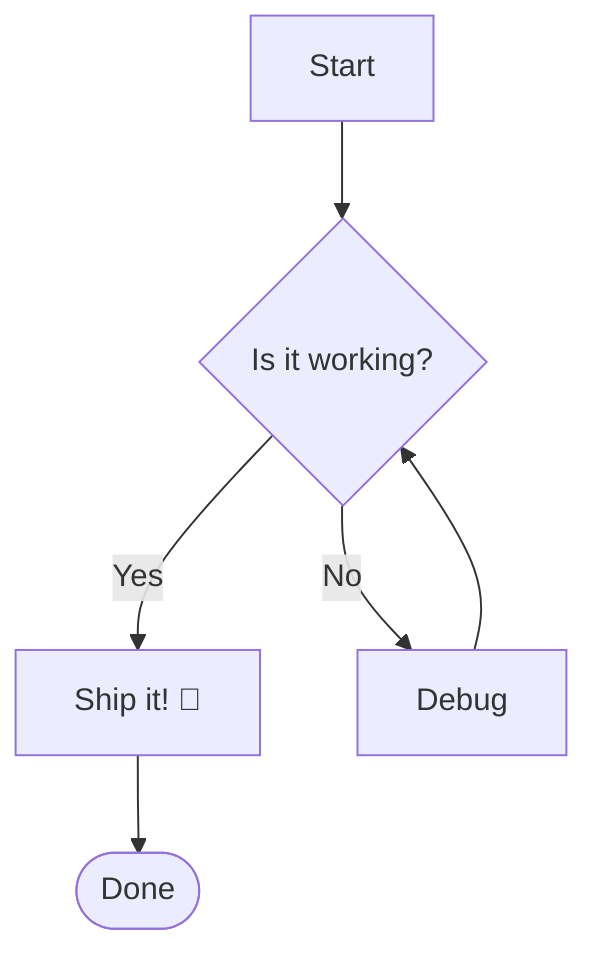

### 3.2 Sequence diagram

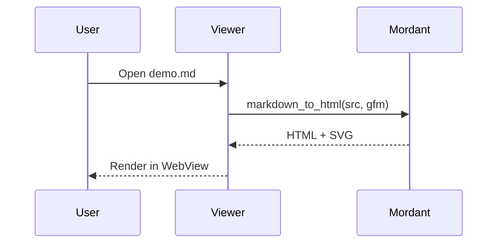

### 3.3 Class diagram

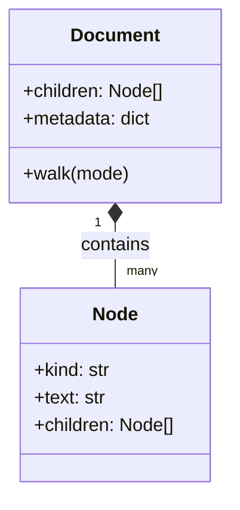

### 3.4 State diagram

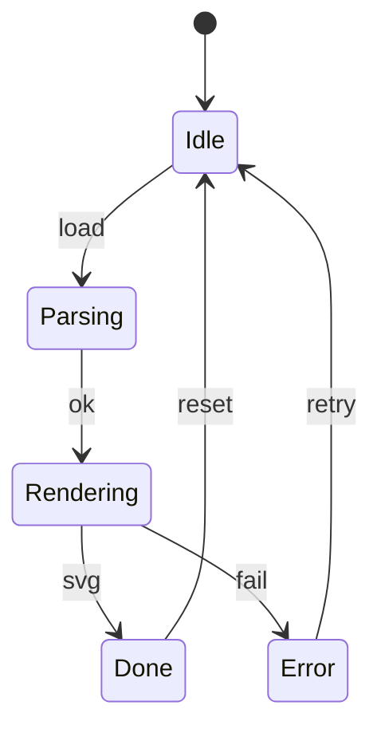

### 3.5 Entity-relationship

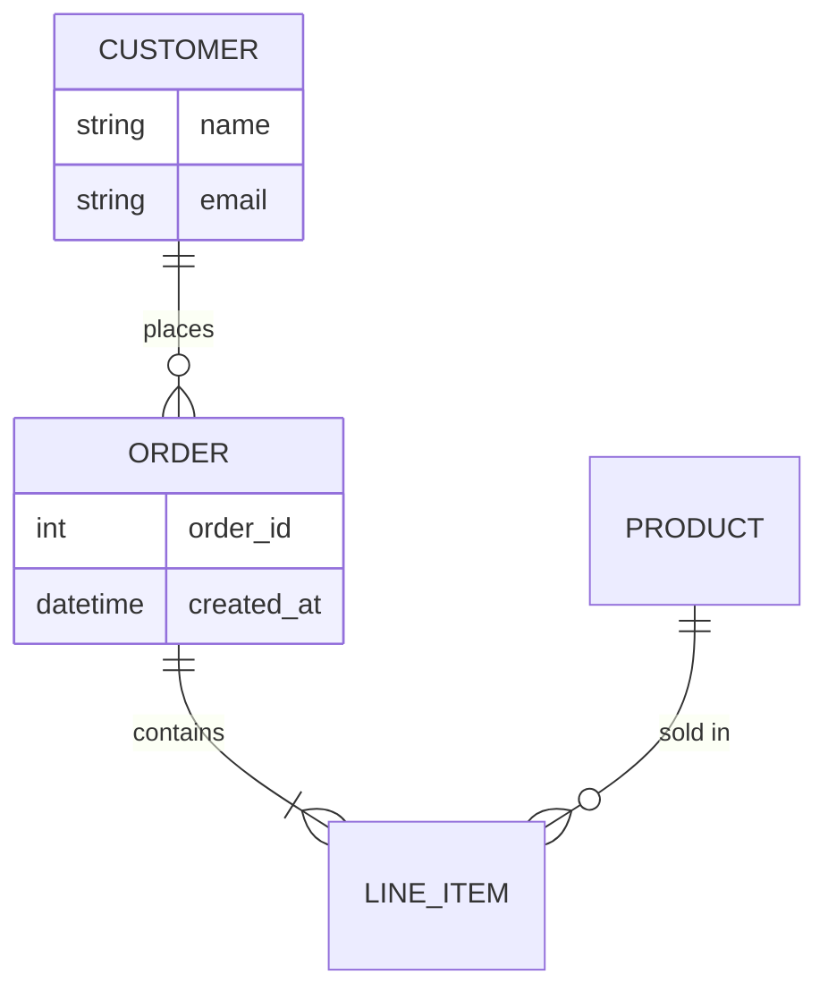

### 3.6 Gantt chart

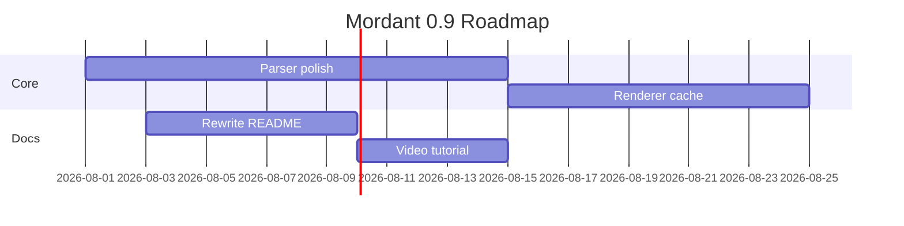

### 3.7 Pie chart

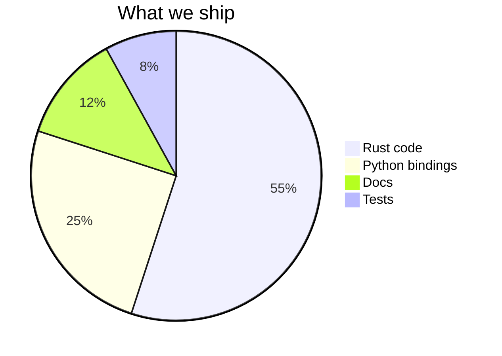

### 3.8 Journey

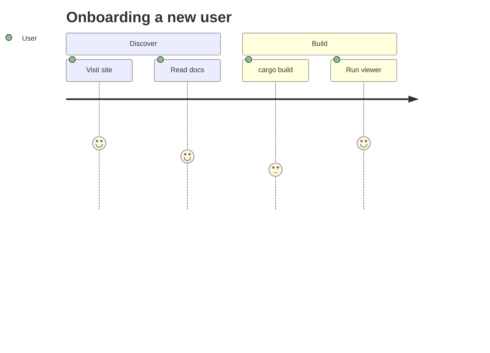

### 3.9 Git graph

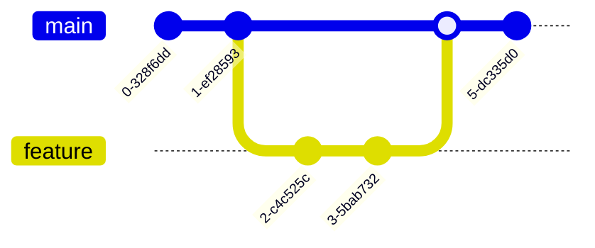

### 3.10 Mindmap

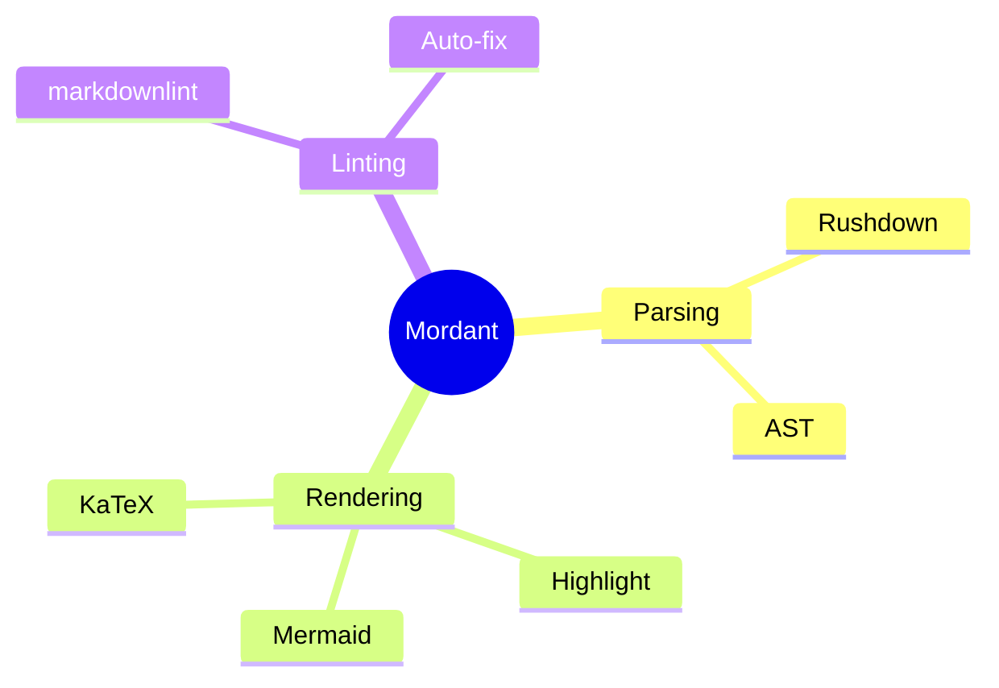

### 3.11 Timeline

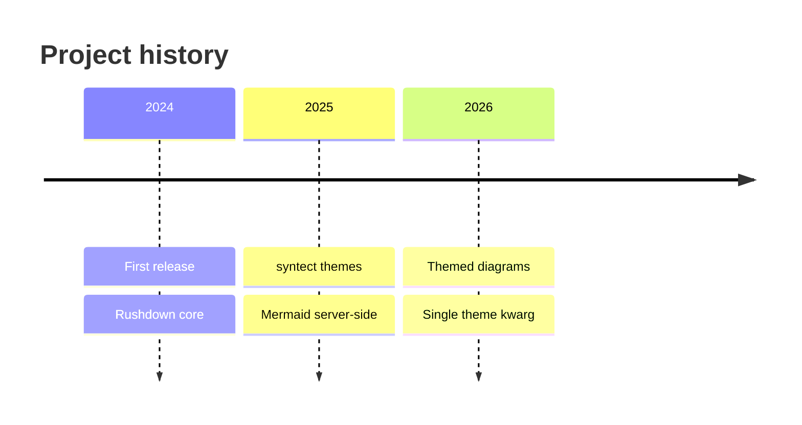

### 3.12 Quadrant chart

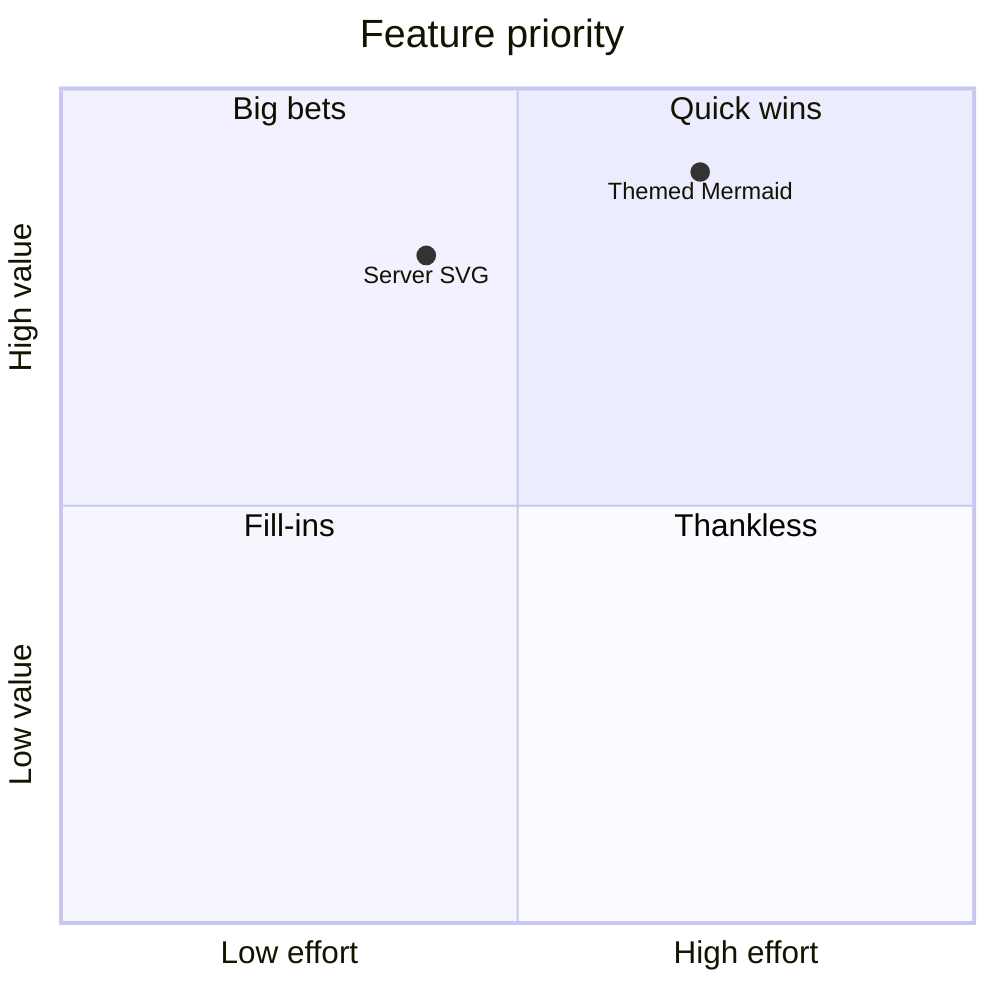

---

## 4. Mathematics (KaTeX)

A display block via the `math` fence:

```math
\int_{0}^{\infty} e^{-x^2}\,dx = \frac{\sqrt{\pi}}{2}
```

The same formula via the `latex` fence:

```latex
\sum_{i=1}^{n} i = \frac{n(n+1)}{2}
```

And a centered display equation between `$$`:

$$
\nabla \times \vec{B} - \frac{1}{c}\frac{\partial \vec{E}}{\partial t}
= \frac{4\pi}{c}\vec{J}
\qquad
\nabla \cdot \vec{E} = 4\pi\rho
$$

Inline math is also supported, e.g. the quadratic formula
$x = \frac{-b \pm \sqrt{b^2 - 4ac}}{2a}$ appears right in the text.

---

## 5. Emoji shortcodes :heart: :tada: :fire:

Shortcodes are resolved to Unicode: `:wave:` → :wave:, `:rocket:` → :rocket:,
`:bulb:` → :bulb:, `:warning:` → :warning:, `:white_check_mark:` → :white_check_mark:.

On a line together: :star: :zap: :coffee: :lock: :unlock: :rocket: :sparkles:

---

## 6. Footnotes[^1] and references[^note]

Footnotes are always enabled. You can reference the same note twice[^note] to get
multiple back-links.

[^1]: The first footnote, defined at the bottom of the document.
[^note]: A named footnote used more than once in the body text.

---

## 7. Images (inline SVG, renders offline)


---

## 8. Thematic break & misc

Above is a thematic break. Here is a fenced `html` block (highlighted, not
executed, since `allows_unsafe` is off by default):

```html
<div class="callout">
  <strong>Note:</strong> raw HTML is escaped unless allows_unsafe is set.
</div>
```

And a final paragraph with a `code span`, a [second link](https://example.com),
and a closing emoji :wave:.

Happy documenting! :tada:
